# Introduction

GL-S10 is a WiFi-BLE gateway using ESP32 as the master MCU. It can connect to superior WiFi network as STA and accept BLE command at the same time. It provides a network interface, a reset button and three LEDs.

# Directory Structure
```
─ app_configuration_tool  #Configuration tool of ble gateway
│   └── android
│       └── apk
├── demo
│   └── BLE-Gateway-Demo  #Source code of ble gateway demo
│
├── docs
│   ├── GL-S10 BLE-Gateway User Guide.pdf
│   └── GL-S10 Datasheet CN.pdf
└── VERSION_FILE          #Revision information record
```
# Prerequisites

This tutorial is built on Ubuntu 20.10, and it is recommended that you use this or higher version to build your environment.

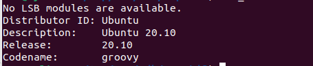

# Environment configuration

## Installing Packages

```
sudo apt-get update
sudo apt-get install git wget flex bison gperf python3 python3-pip python3-setuptools libffi-dev libssl-dev libncurses5-dev
sudo update-alternatives --install /usr/bin/python python /usr/bin/python3 10 && alias pip=pip3
```

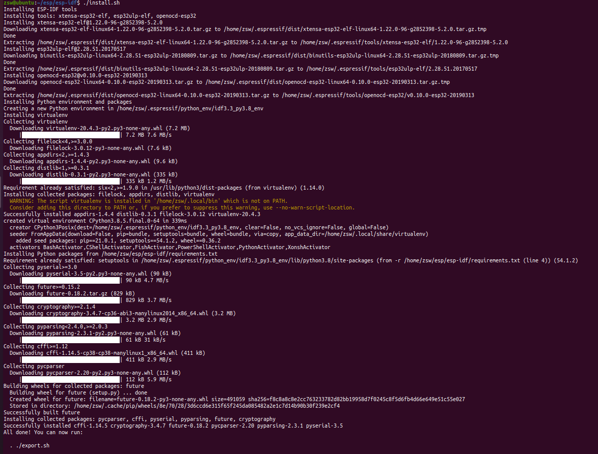

## Downloading Source

```
cd ~
mkdir -p ~/esp
cd esp
git clone https://github.com/espressif/esp-idf.git
git clone https://github.com/gl-inet/s10.git
cd esp-idf
git reset --hard bf022060964128556b3d3205b65c5d35df9beef6     //Make sure you switch here commit-bf022060964128556b3d3205b65c5d35df9beef6
```


## Update the child library

```
git submodule deinit -f .
git submodule init
git submodule update
./install.sh
```

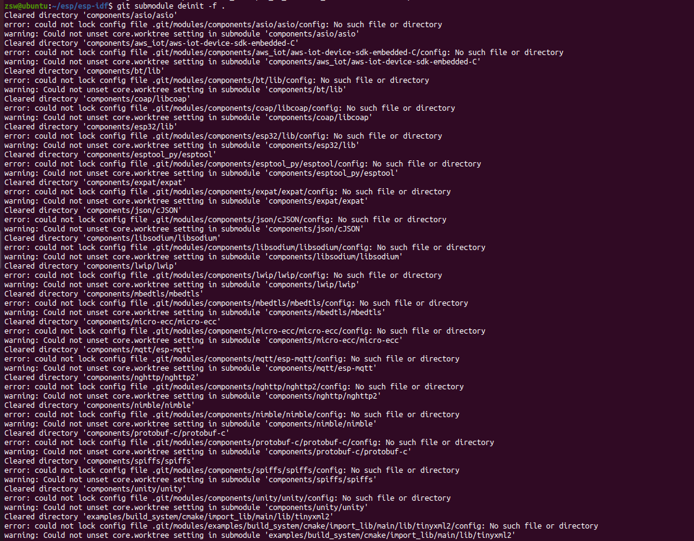

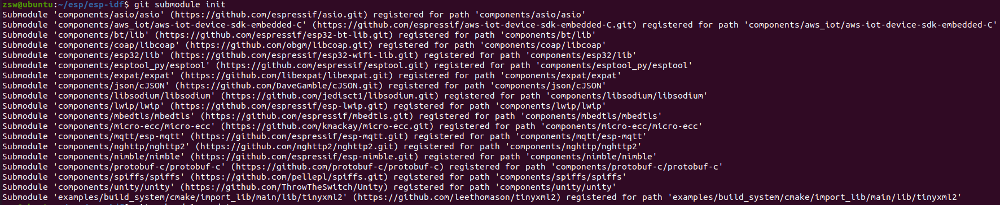

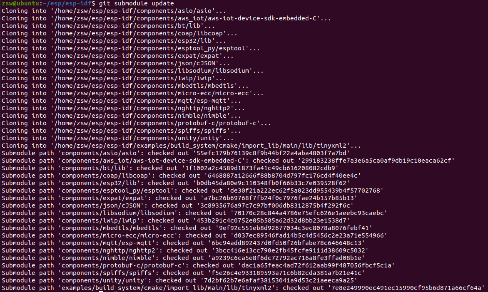

## Compile the project

```
cd ~/esp/s10/demo/BLE-Gateway-Demo/
. ~/esp/esp-idf/export.sh
make clean
make all
```

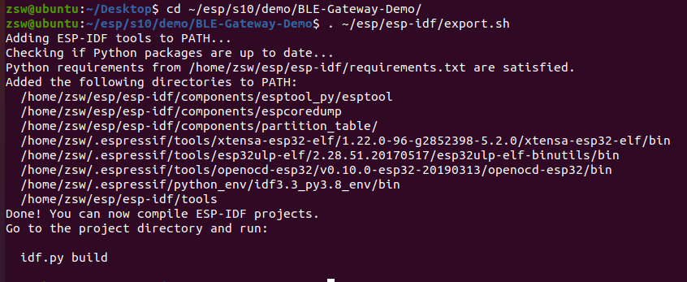

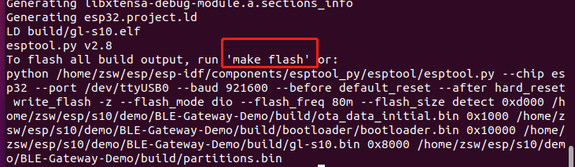

## Firmware writing

1.We need to prepare a USB-TTL here we are using the ai-thinker USB-T1(CP2102)。 [CP2102 driver link(**windos**)](https://docs.ai-thinker.com/_media/tools/serial_driver_windos.7z)

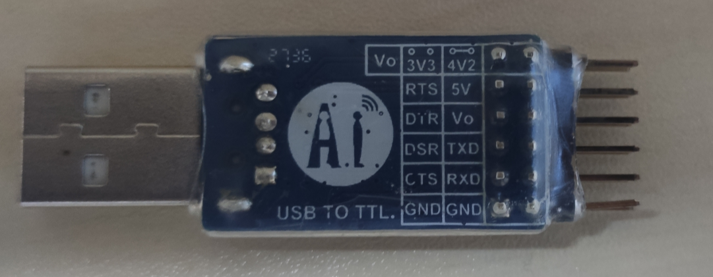

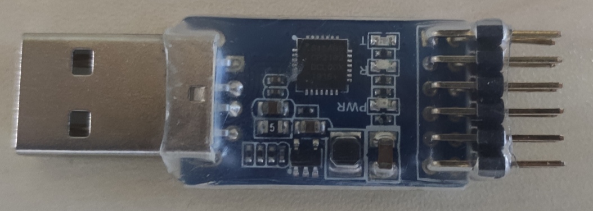

2.The following is the burn in pin distribution on our GL S10 PCB：

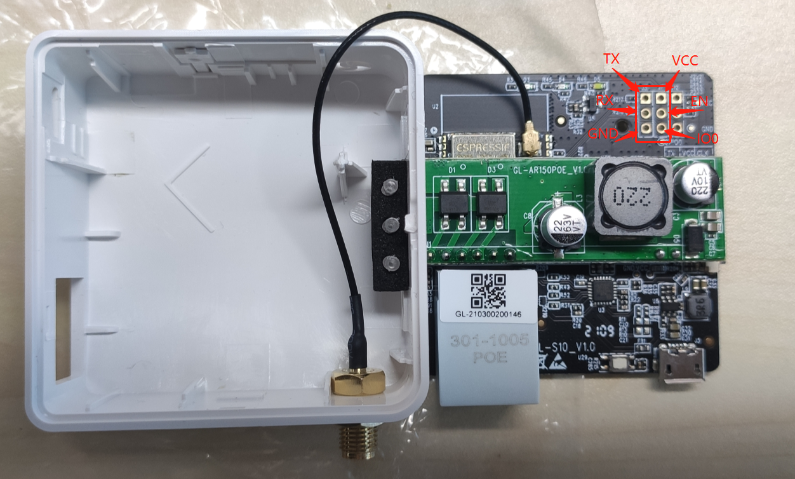

3.We need to connect GL-S10 and PC via USB-TTL：


4.Check whether USB-TTL is connected to Linux and grant permissions:

```
ll /dev/ttyUSB*
sudo chmod 777 /dev/ttyUSB0
```

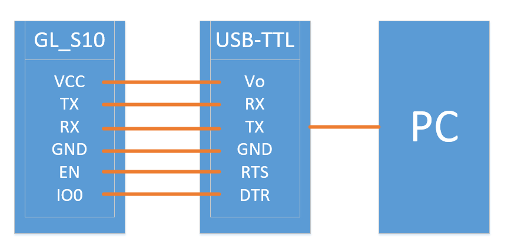

5.When the device confirms the connection, it can begin writing the firmware：

```
make flash
```

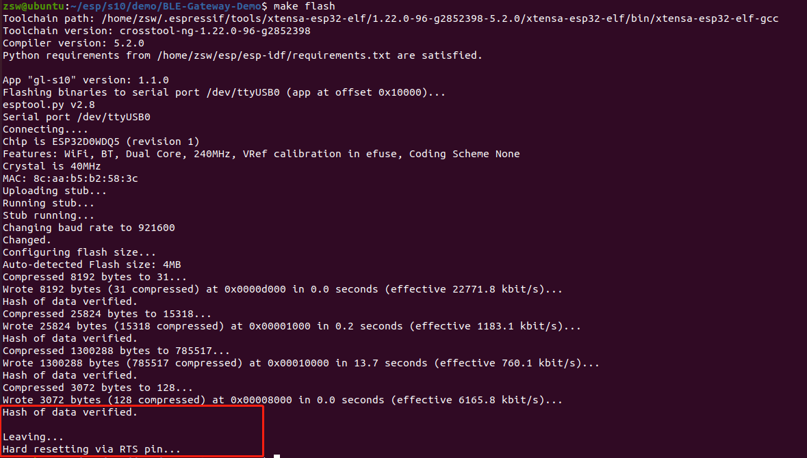


## Serial port log listening

```
make monitor
```

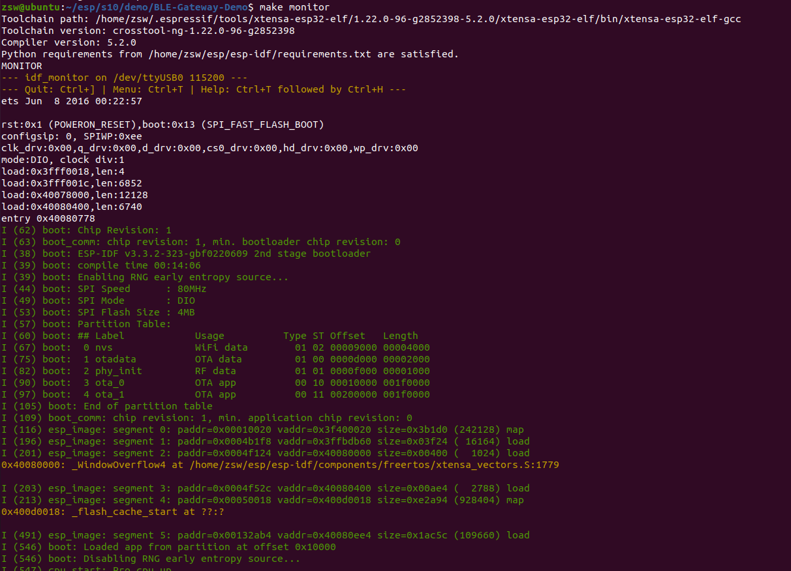

## OTA

The OTA of GL-S10 is to access the server via HTTP to obtain the firmware. See the relevant operation steps.[GL-S10 BLE-Gateway User Guide](docs/GL-S10_BLE-Gateway_User_Guide.pdf)


# How to use
If you want to know the s10 hardware parameters, please refer to the [GL-S10 Datasheet CN](docs/GL-S10_Datasheet_CN.pdf)

If you want to know how to use the ble gateway, please refer to the [GL-S10 BLE-Gateway User Guide](docs/GL-S10_BLE-Gateway_User_Guide.pdf)
